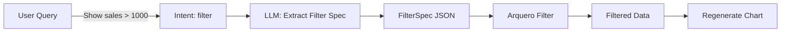
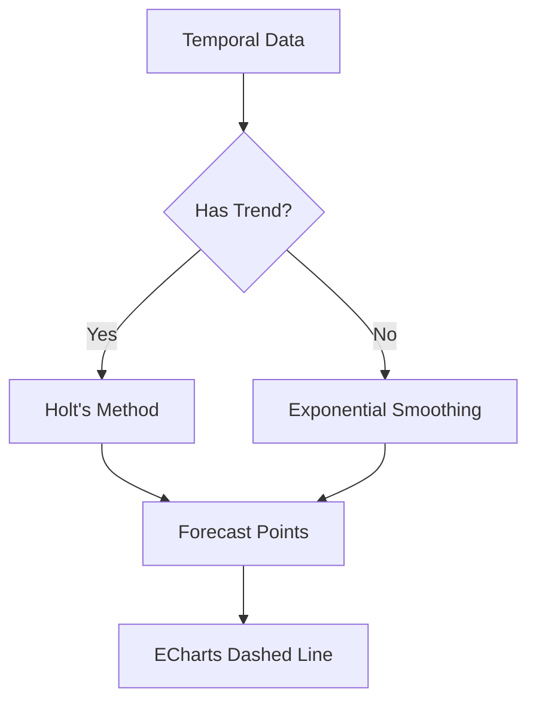
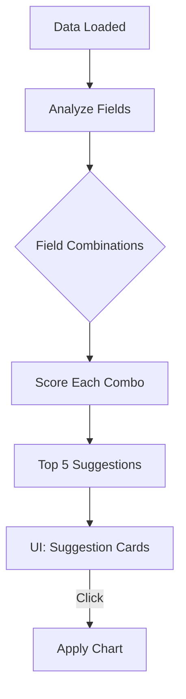
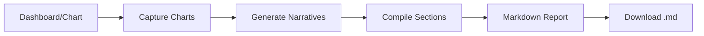
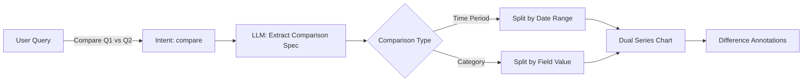

# AI Features Implementation Plan

> **Project**: OpenViz AI Enhancement
> **Features**: NL Filtering, Predictive Analytics, Chart Recommendations, Report Generation, Comparison Mode
> **Last Updated**: January 27, 2026

---

## User Review Required

> [!IMPORTANT]
> This plan adds 5 major AI features. Please review the scope and priority order before implementation begins.

> [!WARNING]
> - **Predictive Analytics** uses client-side forecasting (no external ML services)
> - **Report Generation** creates markdown exports (PDF can be added later)
> - **Comparison Mode** requires date parsing for time period comparisons

---

## Feature 1: Natural Language Data Filtering

### Overview
Enable users to filter data using natural language: *"Show only sales greater than $1000"* or *"Filter to just North region"*.

### Architecture



### Proposed Changes

---

#### [NEW] `backend/services/filterService.ts`

New service to handle filter parsing and application:

```typescript
// Core interfaces
interface FilterCondition {
    field: string;
    operator: '<' | '>' | '=' | '!=' | '<=' | '>=' | 'contains' | 'startsWith' | 'in';
    value: string | number | string[];
}

interface FilterSpec {
    conditions: FilterCondition[];
    combinator: 'AND' | 'OR';
}

// Functions
export function parseFilterFromNL(query: string, fields: FieldInfo[]): Promise<FilterSpec>
export function applyFilters(data: DataRecord[], filterSpec: FilterSpec): DataRecord[]
export function formatActiveFilters(filterSpec: FilterSpec): string
```

**Estimated Lines**: ~150

---

#### [MODIFY] `backend/services/groqService.ts`

Add new intent type and handler:

```diff
// Intent types
-type AIIntent = 'question' | 'chart' | 'dashboard' | 'modify' | 'modify_dashboard' | 'explain' | 'unknown';
+type AIIntent = 'question' | 'chart' | 'dashboard' | 'modify' | 'modify_dashboard' | 'explain' | 'filter' | 'unknown';

// New function
+export async function processFilterRequest(
+    query: string,
+    fields: FieldInfo[],
+    dataProfile: DataProfile
+): Promise<AIQueryResult>
```

**Changes**:
- Add `filter` intent to `detectIntent()` prompt
- Add filter keywords: "filter", "only show", "where", "greater than", "less than", "exclude"
- New `processFilterRequest()` function (~80 lines)

---

#### [MODIFY] `frontend/src/store/useVizStore.ts`

Add filter state and actions:

```typescript
// New state
activeFilters: FilterSpec | null;
filteredData: DataRecord[] | null;

// New actions
applyFilter: (filterSpec: FilterSpec) => void;
clearFilters: () => void;
```

**Changes**: ~40 lines

---

#### [MODIFY] `frontend/src/components/canvas/Canvas.tsx`

Add filter indicator badge:

```typescript
// Show active filters badge
{activeFilters && (
    <Badge variant="secondary" className="flex items-center gap-1">
        <Filter className="h-3 w-3" />
        {activeFilters.conditions.length} filter(s) active
        <X onClick={clearFilters} className="h-3 w-3 cursor-pointer" />
    </Badge>
)}
```

**Changes**: ~25 lines

---

## Feature 2: Predictive Analytics (Forecasting)

### Overview
Add time-series forecasting for temporal data: *"Forecast next 3 months"* or *"Predict Q4 sales"*.

### Architecture

Uses **client-side** forecasting (no external API):
- **Simple Exponential Smoothing** for non-seasonal data
- **Holt's Linear Trend** for data with trend
- **Linear Regression** (already exists in `annotationService.ts`)



### Proposed Changes

---

#### [NEW] `backend/services/forecastService.ts`

New forecasting service:

```typescript
interface ForecastResult {
    forecasts: { x: string | number; y: number; confidence?: { low: number; high: number } }[];
    method: 'exponential' | 'holt' | 'linear';
    accuracy: { mape: number; rmse: number };
}

// Core functions
export function detectSeasonality(data: number[]): { seasonal: boolean; period?: number }
export function exponentialSmoothing(data: number[], alpha: number, periods: number): number[]
export function holtsLinearTrend(data: number[], alpha: number, beta: number, periods: number): number[]
export function generateForecast(
    data: DataRecord[],
    xField: string,
    yField: string,
    periodsAhead: number
): ForecastResult
```

**Estimated Lines**: ~200

---

#### [MODIFY] `backend/services/groqService.ts`

Add forecast intent:

```diff
-type AIIntent = 'question' | 'chart' | 'dashboard' | 'modify' | 'modify_dashboard' | 'explain' | 'filter' | 'unknown';
+type AIIntent = 'question' | 'chart' | 'dashboard' | 'modify' | 'modify_dashboard' | 'explain' | 'filter' | 'forecast' | 'unknown';

+export async function processForecastRequest(
+    query: string,
+    data: DataRecord[],
+    fields: FieldInfo[],
+    currentEncodings: ShelfPlacement[]
+): Promise<AIQueryResult>
```

**Changes**:
- Detect forecast keywords: "forecast", "predict", "project", "next X months/weeks/days"
- Parse forecast period from query
- ~100 lines

---

#### [MODIFY] `backend/utils/echartsOptionBuilder.ts`

Add forecast rendering:

```typescript
// Add dashed line series for forecast
function addForecastSeries(option: EChartsOption, forecastData: ForecastResult): EChartsOption {
    // Adds:
    // - Dashed line for predictions
    // - Confidence interval area (optional)
    // - Vertical marker at "forecast starts" point
}
```

**Changes**: ~60 lines

---

#### [MODIFY] `frontend/src/store/useVizStore.ts`

Add forecast state:

```typescript
// State
forecastData: ForecastResult | null;
forecastPeriods: number;

// Actions
generateForecast: (periods: number) => Promise<void>;
clearForecast: () => void;
```

**Changes**: ~50 lines

---

## Feature 3: Proactive Chart Recommendations

### Overview
Automatically suggest interesting charts based on data characteristics when data is loaded.

### Architecture



### Scoring Algorithm

| Factor | Weight | Description |
|--------|--------|-------------|
| Cardinality Match | 30% | Low cardinality nominal + high variety quantitative |
| Type Compatibility | 25% | Temporal x Quantitative gets bonus |
| Data Variance | 20% | High variance = more interesting |
| Correlation | 15% | Fields with correlation are prioritized |
| User Patterns | 10% | Charts similar to previous selections |

### Proposed Changes

---

#### [NEW] `backend/services/recommendationService.ts`

New recommendation engine:

```typescript
interface ChartRecommendation {
    id: string;
    mark: MarkType;
    xField: FieldInfo;
    yField: FieldInfo;
    colorField?: FieldInfo;
    score: number;
    reason: string; // "Sales varies significantly by Region"
    preview?: string; // Base64 thumbnail (optional, Phase 2)
}

// Functions
export function analyzeFieldPairs(fields: FieldInfo[], data: DataRecord[]): FieldPairAnalysis[]
export function scoreChartCandidate(pair: FieldPairAnalysis, mark: MarkType): number
export function generateRecommendations(
    fields: FieldInfo[],
    data: DataRecord[],
    limit?: number
): ChartRecommendation[]
export function getRecommendationReason(rec: ChartRecommendation): string
```

**Estimated Lines**: ~250

---

#### [MODIFY] `frontend/src/store/useVizStore.ts`

Add recommendation state:

```typescript
// State
chartRecommendations: ChartRecommendation[];
recommendationsLoading: boolean;

// Actions (called automatically on data load)
generateRecommendations: () => void;
applyRecommendation: (recommendationId: string) => void;
dismissRecommendation: (recommendationId: string) => void;
```

**Changes**: ~60 lines

---

#### [NEW] `frontend/src/components/recommendations/RecommendationPanel.tsx`

Floating panel showing suggestions:

```tsx
// Displays 3-5 recommendation cards
// Each card shows:
// - Chart type icon
// - Field names: "Revenue by Region"
// - Reason: "Shows clear trend over time"
// - Quick apply button
```

**Estimated Lines**: ~120

---

#### [MODIFY] `frontend/src/components/layout/AppLayout.tsx`

Mount recommendation panel:

```tsx
{chartRecommendations.length > 0 && !echartsOption && (
    <RecommendationPanel recommendations={chartRecommendations} />
)}
```

**Changes**: ~10 lines

---

## Feature 4: Report Generation (AI Narratives)

### Overview
Generate comprehensive markdown reports with AI-written narratives, chart images, and key findings.

### Architecture



### Report Structure

```markdown
# Data Analysis Report

## Executive Summary
[AI-generated 2-3 sentence overview]

## Key Findings
- Finding 1 with data backing
- Finding 2 with data backing

## Chart Analysis

### [Chart 1 Title]

[AI narrative explaining what chart shows]

## Data Quality Notes
[Any issues detected]

## Appendix
- Data source: [filename]
- Generated: [timestamp]
- Charts: [count]
```

### Proposed Changes

---

#### [NEW] `backend/services/reportService.ts`

Report generation service:

```typescript
interface ReportSection {
    type: 'heading' | 'text' | 'chart' | 'list' | 'table';
    content: string;
    level?: 1 | 2 | 3;
    chartId?: string;
    imageData?: string; // Base64
}

interface Report {
    title: string;
    sections: ReportSection[];
    generatedAt: string;
    dataSource: string;
}

// Functions
export async function generateExecutiveSummary(
    dataProfile: DataProfile,
    charts: ChartConfig[]
): Promise<string>

export async function generateChartNarrative(
    chartConfig: ChartConfig,
    data: DataRecord[]
): Promise<string>

export async function generateFullReport(
    dashboard: DashboardConfig | null,
    chartConfig: ChartConfig | null,
    dataProfile: DataProfile,
    data: DataRecord[]
): Promise<Report>

export function compileToMarkdown(report: Report): string
```

**Estimated Lines**: ~300

---

#### [MODIFY] `backend/services/groqService.ts`

Add report generation prompts:

```typescript
// New function for narrative generation
export async function generateNarrative(
    chartConfig: ChartConfig,
    dataProfile: DataProfile,
    context: string
): Promise<string>
```

**Changes**: ~80 lines

---

#### [NEW] `frontend/src/components/report/ReportGenerator.tsx`

UI for report generation:

```tsx
// Modal with:
// - Report preview
// - Section toggles (include/exclude)
// - Download button (.md)
// - Copy to clipboard
```

**Estimated Lines**: ~150

---

#### [MODIFY] `frontend/src/store/useVizStore.ts`

Add report state:

```typescript
// State
reportData: Report | null;
reportLoading: boolean;

// Actions
generateReport: () => Promise<void>;
downloadReport: () => void;
```

**Changes**: ~40 lines

---

#### [MODIFY] `frontend/src/components/canvas/Canvas.tsx`

Add report button:

```tsx
<Button onClick={generateReport} variant="outline">
    <FileText className="h-4 w-4 mr-2" />
    Generate Report
</Button>
```

**Changes**: ~15 lines

---

## Feature 5: Comparison Mode

### Overview
Enable users to compare data across different dimensions: *"Compare sales Q1 vs Q2"* or *"Compare North vs South region"*.

### Architecture



### Comparison Types

| Type | Example | Visual Output |
|------|---------|---------------|
| Time Period | "Q1 vs Q2 2025" | Overlaid line/bar charts |
| Category | "North vs South" | Side-by-side bars/grouped |
| Metric | "Revenue vs Profit" | Dual Y-axis chart |
| YoY (Year-over-Year) | "This year vs last year" | Overlaid with % change |

### Proposed Changes

---

#### [NEW] `backend/services/comparisonService.ts`

New comparison service:

```typescript
interface ComparisonSpec {
    type: 'time_period' | 'category' | 'metric' | 'yoy';
    baseGroup: { field: string; value?: string; startDate?: string; endDate?: string };
    compareGroup: { field: string; value?: string; startDate?: string; endDate?: string };
    aggregateField: string;
    aggregation: 'sum' | 'avg' | 'count';
}

interface ComparisonResult {
    baseData: { label: string; value: number }[];
    compareData: { label: string; value: number }[];
    differences: { label: string; diff: number; percentChange: number }[];
    summary: { baseTotal: number; compareTotal: number; netChange: number; percentChange: number };
}

// Functions
export function parseComparisonFromNL(query: string, fields: FieldInfo[]): Promise<ComparisonSpec>
export function executeComparison(data: DataRecord[], spec: ComparisonSpec): ComparisonResult
export function detectTimePeriods(query: string): { period1: DateRange; period2: DateRange } | null
export function formatComparisonSummary(result: ComparisonResult): string
```

**Estimated Lines**: ~220

---

#### [MODIFY] `backend/services/groqService.ts`

Add compare intent:

```diff
-type AIIntent = 'question' | 'chart' | 'dashboard' | 'modify' | 'modify_dashboard' | 'explain' | 'filter' | 'forecast' | 'unknown';
+type AIIntent = 'question' | 'chart' | 'dashboard' | 'modify' | 'modify_dashboard' | 'explain' | 'filter' | 'forecast' | 'compare' | 'unknown';

+export async function processCompareRequest(
+    query: string,
+    data: DataRecord[],
+    fields: FieldInfo[],
+    dataProfile: DataProfile
+): Promise<AIQueryResult>
```

**Changes**:
- Detect compare keywords: "compare", "vs", "versus", "difference between", "year over year"
- Parse comparison targets from query
- ~100 lines

---

#### [MODIFY] `backend/utils/echartsOptionBuilder.ts`

Add comparison chart rendering:

```typescript
// Build comparison visualization
function buildComparisonChart(
    result: ComparisonResult,
    spec: ComparisonSpec,
    baseConfig: ChartConfig
): EChartsOption {
    // Generates:
    // - Grouped/stacked bar chart for category comparison
    // - Overlaid line chart for time period comparison
    // - Dual Y-axis for metric comparison
    // - Difference annotations (arrows, % change labels)
}
```

**Changes**: ~80 lines

---

#### [MODIFY] `frontend/src/store/useVizStore.ts`

Add comparison state:

```typescript
// State
comparisonMode: boolean;
comparisonSpec: ComparisonSpec | null;
comparisonResult: ComparisonResult | null;

// Actions
setComparisonMode: (enabled: boolean) => void;
applyComparison: (spec: ComparisonSpec) => void;
clearComparison: () => void;
```

**Changes**: ~50 lines

---

#### [MODIFY] `frontend/src/components/canvas/Canvas.tsx`

Add comparison indicator:

```tsx
{comparisonMode && comparisonResult && (
    <div className="absolute top-4 left-4 bg-purple-500/20 backdrop-blur-md rounded-lg p-3">
        <div className="text-sm font-medium text-purple-300">Comparison Mode</div>
        <div className="text-xs text-purple-200">
            {comparisonResult.summary.percentChange > 0 ? '↑' : '↓'}
            {Math.abs(comparisonResult.summary.percentChange).toFixed(1)}% change
        </div>
        <Button size="sm" variant="ghost" onClick={clearComparison}>Exit</Button>
    </div>
)}
```

**Changes**: ~30 lines

---

## Implementation Priority

| Priority | Feature | Complexity | Dependencies | Est. Time |
|----------|---------|------------|--------------|-----------|
| 1 | Chart Recommendations | Medium | None | 2-3 hours |
| 2 | NL Data Filtering | Medium | Intent detection | 2-3 hours |
| 3 | Report Generation | Medium | Existing summaries | 3-4 hours |
| 4 | Comparison Mode | Medium-High | Date parsing, filtering | 3-4 hours |
| 5 | Predictive Analytics | High | Temporal data | 4-5 hours |

**Recommended Order**: 1 → 2 → 3 → 4 → 5

---

## Verification Plan

### Automated Tests

> [!NOTE]
> No existing test framework found in project. Tests will be manual for now.

### Manual Verification

#### Feature 1: NL Data Filtering

1. **Start dev server**: `npm run dev` in project root
2. **Upload sample data**: Use a CSV with numeric and categorical columns
3. **Test filter queries**:
   - "Show only rows where Revenue > 5000"
   - "Filter to just North region"
   - "Exclude products with price less than 10"
4. **Verify**: Chart updates with filtered data, filter badge appears

#### Feature 2: Predictive Analytics

1. **Upload temporal data**: CSV with date column and numeric values
2. **Create line chart**: "Show sales over time"
3. **Test forecast**: "Forecast the next 3 months"
4. **Verify**: Dashed forecast line appears beyond actual data

#### Feature 3: Chart Recommendations

1. **Start fresh**: Clear any existing charts
2. **Upload diverse data**: CSV with 5+ columns (mix of types)
3. **Verify**: Recommendation cards appear automatically
4. **Test apply**: Click a recommendation, chart should render

#### Feature 4: Report Generation

1. **Create dashboard**: With 2-3 charts
2. **Click "Generate Report"**: Modal should appear
3. **Verify content**: Executive summary, chart narratives present
4. **Download**: Save as .md, open in viewer to confirm formatting

#### Feature 5: Comparison Mode

1. **Upload temporal/categorical data**: CSV with dates or categories
2. **Test time comparison**: "Compare January vs February sales"
3. **Test category comparison**: "Compare North vs South region"
4. **Verify**: Dual series chart with difference annotations
5. **Check summary**: % change indicator visible

---

## Files Summary

| Action | File | Est. Lines |
|--------|------|------------|
| NEW | `backend/services/filterService.ts` | 150 |
| NEW | `backend/services/forecastService.ts` | 200 |
| NEW | `backend/services/recommendationService.ts` | 250 |
| NEW | `backend/services/reportService.ts` | 300 |
| NEW | `backend/services/comparisonService.ts` | 220 |
| NEW | `frontend/src/components/recommendations/RecommendationPanel.tsx` | 120 |
| NEW | `frontend/src/components/report/ReportGenerator.tsx` | 150 |
| MODIFY | `backend/services/groqService.ts` | +360 |
| MODIFY | `backend/utils/echartsOptionBuilder.ts` | +140 |
| MODIFY | `frontend/src/store/useVizStore.ts` | +240 |
| MODIFY | `frontend/src/components/canvas/Canvas.tsx` | +70 |
| MODIFY | `backend/types/index.ts` | +80 |
| **TOTAL** | | **~2,280** |

---

*Awaiting approval to begin implementation.*
