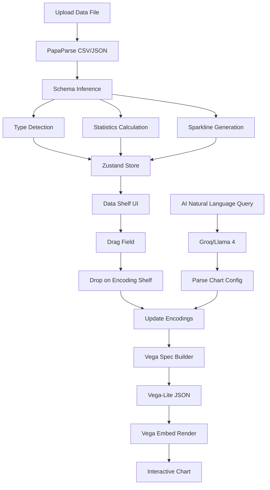

# 🎨 OpenViz

> **AI-Powered Data Visualization Platform** – Transform your data into beautiful, interactive charts using natural language and intuitive drag-and-drop controls.


---

## 📖 Overview

**OpenViz** is a modern, web-based data visualization tool that combines the power of **Vega-Lite** grammar-based charting with **AI-assisted chart generation**. Simply upload your data, describe what you want to see in natural language, or drag fields onto encoding channels – OpenViz handles the rest.

### ✨ Key Highlights

- 🤖 **Natural Language Charting** – Describe your chart in plain English
- 🎯 **Drag-and-Drop Interface** – Intuitive field-to-channel mapping
- 📊 **Vega-Lite Powered** – Industry-standard visualization grammar
- ⚡ **Real-time Preview** – See changes instantly as you build
- 🔧 **Code Editor** – Direct JSON manipulation with Monaco Editor
- 🌙 **Dark Mode UI** – Modern, sleek interface

---

## 🚀 Features

### 1. 📁 Data Import & Profiling

Upload your datasets and let OpenViz automatically analyze them:

| Feature | Description |
|---------|-------------|
| **File Support** | CSV, TSV, and JSON files |
| **Auto Type Detection** | Automatically identifies quantitative, nominal, temporal, and ordinal fields |
| **Statistics** | Calculates min, max, mean, median, standard deviation for numeric fields |
| **Sparklines** | Inline data distribution previews for each field |
| **Top Values** | Shows most frequent values for categorical fields |

### 2. 🎨 Visual Encoding System

Build charts by mapping data fields to visual channels:

| Channel | Purpose | Example |
|---------|---------|---------|
| **X** | Horizontal position | Categories, dates |
| **Y** | Vertical position | Measures, counts |
| **Color** | Hue encoding | Group comparisons |
| **Size** | Mark size | Quantitative emphasis |
| **Shape** | Mark shape | Additional categorization |
| **Row/Column** | Faceting | Small multiples |

**Supported Chart Types:**
- 📊 Bar Charts
- 📈 Line Charts
- 🔵 Scatter Plots (Point)
- 📉 Area Charts
- 🥧 Arc/Pie Charts
- ▪️ Rect (Heatmaps)
- 📏 Rules & Ticks
- 📝 Text Labels

### 3. 🤖 AI-Powered Features

#### Natural Language Charting
Type queries like:
- *"Show a bar chart of sales by region"*
- *"Create a scatter plot of price vs quantity"*
- *"Trend of revenue over time"*

#### AI Chart Suggestions
OpenViz automatically suggests optimal chart types based on:
- Field types in your dataset
- Current encoding configuration
- Data characteristics

#### Data Insights Generation
AI analyzes your data and provides:
- **Trends** – Patterns over time
- **Anomalies** – Outliers and unusual values
- **Correlations** – Relationships between fields
- **Distributions** – Spread and shape of data
- **Summaries** – Key statistics and takeaways

### 4. ⚡ Auto-Chart Intelligence

When you set mark type to `auto`, OpenViz intelligently selects the best chart type:

| Your Encodings | Suggested Chart |
|----------------|-----------------|
| Nominal X + Quantitative Y | Bar Chart |
| Temporal X + Quantitative Y | Line Chart |
| Quantitative X + Quantitative Y | Scatter Plot |
| Single Quantitative | Histogram |
| Nominal + Nominal | Heatmap |

### 5. 🔧 Code Editor

Toggle to the code view to:
- View generated Vega-Lite JSON specification
- Make direct edits with **Monaco Editor** (VS Code's editor)
- Syntax highlighting and error detection
- Bi-directional sync between visual and code editors

---

## 🛠️ Technology Stack

### Core Framework

| Technology | Version | Purpose |
|------------|---------|---------|
| **React** | 19.2 | UI Framework |
| **TypeScript** | 5.9 | Type Safety |
| **Vite** | 7.2 | Build Tool & Dev Server |

### Visualization

| Technology | Version | Purpose |
|------------|---------|---------|
| **Vega** | 6.2 | Visualization Grammar |
| **Vega-Lite** | 6.4 | High-Level Chart Grammar |
| **react-vega** | 8.0 | React Vega Integration |
| **vega-embed** | 7.1 | Embedding & Interactivity |

### AI Integration

| Technology | Version | Purpose |
|------------|---------|---------|
| **Groq SDK** | 0.37 | AI API Client |
| **Llama 4 Maverick** | 17B | Language Model for NL Processing |

### State Management & UI

| Technology | Version | Purpose |
|------------|---------|---------|
| **Zustand** | 5.0 | Lightweight State Management |
| **@dnd-kit** | 6.3 | Drag-and-Drop System |
| **@radix-ui** | Various | Accessible UI Primitives |
| **Lucide React** | 0.562 | Icon Library |
| **Tailwind CSS** | 4.1 | Utility-First Styling |

### Data Processing

| Technology | Version | Purpose |
|------------|---------|---------|
| **PapaParse** | 5.5 | CSV/TSV Parsing |
| **Arquero** | 8.0 | Data Transformation |
| **date-fns** | 4.1 | Date Parsing & Formatting |

### Development Tools

| Technology | Purpose |
|------------|---------|
| **ESLint** | Code Linting |
| **Monaco Editor** | In-browser Code Editing |
| **PostCSS** | CSS Processing |

---

## 📐 Architecture

```
src/
├── components/
│   ├── ai/                    # AI Chat Interface
│   │   ├── AIChat.tsx         # Floating chat panel
│   │   └── AIQueryBar.tsx     # Query input bar
│   │
│   ├── canvas/                # Visualization Canvas
│   │   ├── Canvas.tsx         # Main canvas container
│   │   ├── VizPreview.tsx     # Vega chart renderer
│   │   └── CodeEditor.tsx     # Monaco JSON editor
│   │
│   ├── data-shelf/            # Data Fields Panel
│   │   ├── DataShelf.tsx      # Field list container
│   │   ├── DraggableField.tsx # Draggable field item
│   │   └── Sparkline.tsx      # Inline data preview
│   │
│   ├── encoding-deck/         # Encoding Configuration
│   │   ├── EncodingDeck.tsx   # Encoding panel
│   │   └── EncodingShelf.tsx  # Drop zone for channels
│   │
│   ├── layout/                # App Layout
│   │   ├── AppLayout.tsx      # Main layout + DnD context
│   │   └── TopBar.tsx         # Header toolbar
│   │
│   └── ui/                    # Reusable UI Components
│       ├── button.tsx
│       ├── dialog.tsx
│       ├── scroll-area.tsx
│       └── ...
│
├── services/
│   └── groqService.ts         # AI/Groq API integration
│
├── store/
│   └── useVizStore.ts         # Zustand state management
│
├── types/
│   └── index.ts               # TypeScript type definitions
│
├── utils/
│   ├── autoChart.ts           # Smart chart type selection
│   ├── schemaInference.ts     # Data type detection
│   └── vegaSpecBuilder.ts     # Vega-Lite spec generation
│
└── lib/
    └── utils.ts               # Utility functions (cn, etc.)
```

---

## 🔄 Data Flow



---

## 🚀 Getting Started

### Prerequisites

- **Node.js** 18+ (LTS recommended)
- **npm** or **yarn**
- **Groq API Key** (for AI features)

### Installation

```bash
# Clone the repository
git clone https://github.com/your-username/openviz.git
cd openviz

# Install dependencies
npm install
```

### Environment Setup

Create a `.env` file in the project root:

```env
# Required for AI features
VITE_GROQ_API_KEY=your_groq_api_key_here

# Optional: Customize AI model
VITE_AI_MODEL=meta-llama/llama-4-maverick-17b-128e-instruct
```

> 💡 **Get a Groq API Key**: Sign up at [console.groq.com](https://console.groq.com) to get your free API key.

### Running the App

```bash
# Start development server
npm run dev

# Build for production
npm run build

# Preview production build
npm run preview
```

The app will be available at `http://localhost:5173`

---

## 📦 Available Scripts

| Command | Description |
|---------|-------------|
| `npm run dev` | Start development server with HMR |
| `npm run build` | Build production bundle |
| `npm run preview` | Preview production build locally |
| `npm run lint` | Run ESLint code analysis |

---

## 🎯 Usage Guide

### Basic Workflow

1. **Upload Data** → Click the upload button in the top bar and select a CSV/JSON file
2. **Explore Fields** → View auto-detected fields with types and statistics in the left panel
3. **Build Chart** → Drag fields from the Data Shelf to Encoding channels (X, Y, Color, etc.)
4. **Customize** → Select chart type, add aggregations, adjust settings
5. **Export** → View or copy the generated Vega-Lite JSON specification

### Using AI Assistant

1. Click the **✨ AI Assistant** button in the bottom-right corner
2. Type a natural language request like:
   - *"Show sales by category as a bar chart"*
   - *"Create a line chart of revenue over time"*
   - *"Scatter plot of price vs rating with color by brand"*
3. The AI will automatically configure the chart for you

### Encoding Options

For each field dropped on a channel, you can configure:

| Option | Description |
|--------|-------------|
| **Aggregate** | sum, mean, count, min, max, median, distinct |
| **Bin** | Group continuous values into bins |
| **Time Unit** | year, quarter, month, week, day, hours |
| **Sort** | ascending, descending |

---

## 🔐 API Configuration

### Groq AI Service

The AI features use the **Groq API** with **Llama 4 Maverick** model:

```typescript
// services/groqService.ts
const AI_MODEL = 'meta-llama/llama-4-maverick-17b-128e-instruct';
```

**Capabilities:**
- Natural language to chart configuration
- Data insights generation
- Smart chart suggestions
- Filter command parsing

---

## 🧩 Type System

OpenViz uses a comprehensive TypeScript type system:

### Field Types
```typescript
type FieldType = 'nominal' | 'quantitative' | 'temporal' | 'ordinal';
```

### Chart Configuration
```typescript
interface ChartConfig {
    id: string;
    title?: string;
    mark: MarkType;
    encodings: ShelfPlacement[];
    width: number | 'container';
    height: number | 'container';
    interactive?: boolean;
}
```

### Encoding Channels
```typescript
type EncodingChannel = 'x' | 'y' | 'color' | 'size' | 'shape' | 'tooltip' | 'row' | 'column';
```

---

## 🌟 Key Implementation Details

### State Management (Zustand)

The app uses Zustand with devtools for lightweight, efficient state:

```typescript
export const useVizStore = create<VizState & VizActions>()(
    devtools(
        (set, get) => ({
            // Data state
            dataset: null,
            uploadStatus: { state: 'idle', progress: 0 },
            
            // Encoding state
            encodings: [],
            
            // Chart configuration
            chartConfig: initialChartConfig,
            vegaSpec: null,
            
            // Actions...
        }),
        { name: 'openviz-store' }
    )
);
```

### Schema Inference

Automatic type detection with configurable thresholds:

```typescript
// Detects: quantitative, nominal, temporal, ordinal
const fields = inferSchema(data);
```

### Vega-Lite Spec Building

Converts internal state to valid Vega-Lite JSON:

```typescript
const spec = buildVegaLiteSpec(chartConfig, dataset.data);
```

---

## 🎨 UI Design

- **Color Scheme**: Dark mode with deep blacks (#09090b) and subtle borders
- **Accent Colors**: Violet/Purple gradient for AI features
- **Typography**: Clean, modern sans-serif
- **Icons**: Lucide React icons
- **Animations**: Smooth transitions and micro-interactions

---

## 📄 License

MIT License – feel free to use, modify, and distribute.

---

## 🙏 Acknowledgments

- **Vega-Lite** – The amazing visualization grammar that powers the charts
- **Groq** – Lightning-fast AI inference
- **Meta AI** – Llama 4 model for natural language processing
- **Radix UI** – Accessible component primitives
- **dnd-kit** – Excellent drag-and-drop library

---

<div align="center">
  <p>Built with ❤️ using React, Vega-Lite, and AI</p>
  <p><strong>OpenViz</strong> – See your data, your way.</p>
</div>
